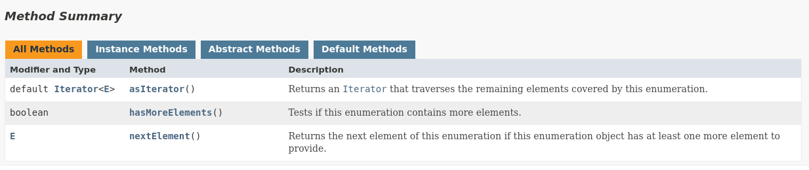

# Interface Iterable

Essa interface faz com que um objeto possa ser iterável por meio de um loop for-each.
É implementada pela Interface Collection.
Esta interface possui uma instância da Interface Iterator, que possibilita a iteração de uma collection, já que todas as implementações de collection implementam Iterable indiretamente.
Desde o Java 1.5.

[Interface Iterable](https://docs.oracle.com/en/java/javase/21/docs/api/java.base/java/lang/Iterable.html)